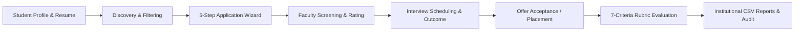

# College Internship Management System (CIMS)

[](https://fastapi.tiangolo.com)
[](https://react.dev)
[](https://tailwindcss.com)
[](https://www.sqlalchemy.org)
[](https://www.docker.com)
[](#testing--verification)

> A **production-ready, enterprise-grade College Internship Management System (CIMS)** designed to connect Students, Faculty Coordinators, Corporate Hiring Partners, and Institutional Administration across the complete internship lifecycle. Built from scratch with real relational database models, rigorous Role-Based Access Control (RBAC), live institutional analytics, 7-criteria performance rubrics, and automated audit logging.

---

## 🌟 Key Highlights & Architecture

### Complete Internship Lifecycle


### Technology Stack
- **Backend:** Python 3.11, [FastAPI](https://fastapi.tiangolo.com/), [SQLAlchemy 2.0](https://www.sqlalchemy.org/) declarative models, [Pydantic v2](https://docs.pydantic.dev/), JWT authentication with Bcrypt password hashing, native SQLite (default zero-config) & PostgreSQL 15 support.
- **Frontend:** [React 19](https://react.dev/), TypeScript 5.8+, [Vite](https://vite.dev/), [Tailwind CSS](https://tailwindcss.com/) (with light/dark theme persistence), [Lucide React](https://lucide.dev/) icons, [Recharts](https://recharts.org/) data visualization, React Router v7.
- **Security & Governance:** Strict server-side RBAC dependencies (`require_admin`, `require_staff_or_admin`, `require_student`), automated immutable audit trail (`AuditLog`), 5 MB PDF-only resume validator, and anti-tamper security policies.

---

## 👥 Role-Based Access Control (RBAC) & Features

### 🎓 1. Student Portal
- **Dashboard & KPIs:** Profile completion progress bar, live metrics for applied roles, shortlists, scheduled interviews, and placement status.
- **Marketplace & Discovery:** Search and multi-filter internships by Technical Domain, Work Mode (Remote, Hybrid, On-site), Minimum Stipend, Duration, and Location.
- **Bookmark & Saved Opportunities:** Save listings to personal wishlist for fast access.
- **5-Step Application Wizard:** Multi-step submission with real-time field validation, PDF resume upload (under 5 MB), dynamic qualifications rubric, and final confirmation.
- **Application Tracking & Visual Timeline:** Live status tracker (`Under Review` → `Shortlisted` → `Interview Scheduled` → `Accepted` / `Rejected`). Ability to withdraw applications with recorded reason.
- **Interview Calendar:** View upcoming corporate screenings, Google Meet / Zoom links, interviewer details, and outcome records.
- **Profile & Resume Dossier:** LinkedIn-style academic profile showcasing GPA, bio, technical skills, projects, certifications, and verified PDF resume link.
- **Corporate Reviews & Feedback:** Rate partner enterprises on culture, mentorship, and work environment; submit platform suggestions to campus coordinators.

### 👩‍🏫 2. Faculty & Internship Coordinator Portal
- **Dashboard & Cohort Insights:** Departmental overview tracking active student applications, pending screening reviews, upcoming candidate interviews, and required rubrics.
- **Opportunity Creator:** Post verified corporate opportunities with duration constraints (4–26 weeks), stipend parameters, and academic skill tags.
- **Candidate Review Hub:** Inspect submitted candidate dossiers, filter by status, score applicants (1–5 stars), record internal notes, and advance candidates (`Shortlist`, `Interview`, `Accept`, `Reject`).
- **Interview Coordination:** Schedule interview rounds with minimum 24-hour advance notice validation, meeting links, and interviewer contact details. Record official results (`Passed`, `Failed`, `On Hold`).
- **Standardized 7-Criteria Rubric Evaluations:** Formal institutional assessment scoring candidates across 7 ABET-aligned competencies (1–5 stars) with computed weighted scores and hiring endorsements.
- **Departmental Compliance Reports:** Visual charts for conversion velocity, domain density, and instant one-click CSV report exports.

### 🏛️ 3. Institutional Administration Portal
- **Executive Analytics Dashboard:** High-level institutional KPIs (total enrollment, partner companies, placement conversion percentage, average cohort stipend, application trajectory charts).
- **Student Roster Management:** Search and filter students by department and GPA. Inspect full student dossiers and toggle account deactivation/activation.
- **Faculty Directory:** Comprehensive faculty supervisor directory with department designations and employee IDs.
- **Corporate Partner Directory:** Onboard enterprise hiring partners, manage corporate registration tax numbers, campus recruitment contacts, and toggle verified/archived states.
- **Internship Opportunity Governance:** Institutional verification workflow to review, approve, or reject pending postings with reviewer notes before they appear on the student marketplace.
- **Global Application Ledger:** Institution-wide registry of all candidate applications with status filters and dossier inspection.
- **Accreditation Rubrics Inspection:** Complete evaluation ledger with radar competency breakdown and archive controls.
- **Compliance CSV Exports:** Instant downloads of `cims_applications_report.csv` and `cims_placement_summary.csv`.
- **Feedback & Moderation:** Review student suggestions and complaints, respond with official remarks, and update resolution statuses.
- **Security Audit Trail:** Immutable event log tracking authentication, account mutations, status updates, and administrative overrides with timestamp, user ID, IP address, and payload.
- **Platform Policies & Settings:** Configure active academic year (`2025-2026`), minimum application GPA threshold (`2.0`), concurrent application caps (`10`), and advance notice hours (`24`).

---

## 📋 7-Criteria Institutional Performance Rubric

All internship evaluations follow a standardized 7-criteria competency framework:

| Criterion | Description | Scale |
| :--- | :--- | :---: |
| **1. Technical Proficiency** | Domain depth, work/code quality, tool mastery | 1 – 5 |
| **2. Communication Skills** | Clarity, responsiveness, documentation, listening | 1 – 5 |
| **3. Problem Solving** | Analytical rigor, initiative, innovative solutions | 1 – 5 |
| **4. Teamwork & Synergy** | Collaboration, receptiveness to feedback | 1 – 5 |
| **5. Punctuality & Attendance** | Meeting presence, deadline dependability | 1 – 5 |
| **6. Accountability & Ownership** | Deliverable ownership, professional ethics | 1 – 5 |
| **7. Adaptability & Learning** | Speed of grasping new tools, learning agility | 1 – 5 |

**Overall Score:** Computed automatically as the normalized average score $\in [1.00, 5.00]$, accompanied by a qualitative hiring recommendation (`Strongly Recommend`, `Recommend`, `Neutral`, `Do Not Recommend`).

---

## 🇮🇳 Real-World Indian Dataset & Pre-Seeded Accounts

The system is built in India for Indian engineering universities, colleges, and Training & Placement Offices (TPO), compliant with **AICTE Internship Policy v3** and **UGC Outcome-Based Education (OBE)** guidelines. All financial data is rendered in Indian National Rupees (**₹ INR**).

It comes pre-seeded with **10 top Indian tech enterprises & GCCs** (TCS, Infosys, Razorpay, Zomato, Flipkart, PhonePe, Reliance Jio, Wipro, HCLTech, Swiggy) with verified **Corporate Identification Numbers (CIN)**, **20 real-world Indian engineering student profiles** across top branches (CSE, IT, AI & Data Science, E&TC, Mechanical), and **20 verified internship opportunities** with stipends ranging from ₹25,000 to ₹60,000 / month across Bengaluru, Pune, Hyderabad, Mumbai, Gurugram, and Noida.

> 💡 **1-Click Demo Switcher:** On the navbar, click the **Demo Accounts** dropdown to switch between personas instantly without manual typing!

| Role | Name & Designation | Email | Password | Access Scope |
| :--- | :--- | :--- | :--- | :--- |
| **Institutional Admin / TPO** | Dr. Rajesh Kulkarni *(Dean - Training & Placement)* | `admin@demo.local` | `Admin@1234` | Full campus governance, company drive approvals, NIRF placement metrics, audit logs |
| **Faculty Coordinator** | Prof. Sunita Sharma *(T&P Coordinator, Computer Engg)* | `faculty@demo.local` | `Faculty@1234` | Post company drives, screen applicants, schedule interview slots, AICTE 7-criteria rubrics |
| **Engineering Student** | Aarav Sharma *(B.Tech Computer Engg '26, CGPA: 9.24)* | `student@demo.local` | `Student@1234` | Discover internships, apply with multi-step wizard, track offers (Placed at Razorpay ₹50k/mo) |

---

## 🚀 Quick Start Guide

### Option A: Local Zero-Config Run (Recommended for Development)

The codebase comes with a configured virtual environment and SQLite default database (`sqlite:///./cims.db`), meaning you can launch both backend and frontend immediately without installing external database servers:

#### 1. Start the Backend API
```bash
# In project root
source venv/bin/activate
uvicorn backend.app.main:app --reload --port 8000
```
- API Base: `http://localhost:8000/api/v1`
- Interactive Swagger UI: `http://localhost:8000/docs`
- ReDoc Documentation: `http://localhost:8000/redoc`

#### 2. Start the Frontend Development Server
```bash
# In a second terminal window
cd frontend
npm run dev
```
- Frontend UI: `http://localhost:5173` (Vite automatically proxies `/api` requests to port 8000).

---

### Option B: Production Docker Compose (PostgreSQL 15 + Nginx + FastAPI)

To run the complete production-grade multi-container environment with PostgreSQL:

```bash
# Build and run all services
docker compose up --build
```
- **Web Portal:** `http://localhost` (Served by Nginx on port 80)
- **Backend API:** `http://localhost:8000`
- **PostgreSQL Database:** `localhost:5432`

---

## 🧪 Testing & Verification

The system includes automated tests covering Authentication, RBAC, Internships, Applications, Evaluations, Reports, and System Settings.

### Run Backend Unit & Integration Tests
```bash
source venv/bin/activate
PYTHONPATH=. pytest backend/tests/ -v
```
*Expected: 19 passed, 0 failed.*

### Run Frontend TypeScript Compilation & Production Build
```bash
cd frontend
npm run build
```
*Expected: Zero type errors, bundled client assets in `frontend/dist/`.*

---

## 📂 Project Structure

```
College Internship Management System/
├── backend/
│   ├── app/
│   │   ├── api/v1/
│   │   │   ├── endpoints/       # Auth, Students, Faculty, Companies, Internships,
│   │   │   │                    # Applications, Interviews, Evaluations, Reports,
│   │   │   │                    # Feedback, Notifications, Audit Logs, Settings, Files
│   │   │   └── api.py           # Unified v1 router
│   │   ├── core/                # Config, Database, JWT Security, RBAC Dependencies
│   │   ├── models/              # SQLAlchemy 2.0 Declarative Relational Models
│   │   ├── schemas/             # Pydantic v2 Request/Response Validation Schemas
│   │   ├── services/            # Audit, Notification, Email templates, File storage
│   │   ├── seed/                # Realistic 20-student + 10-company seed dataset
│   │   └── main.py              # FastAPI application entrypoint
│   ├── tests/                   # Pytest test suites (19 tests)
│   ├── requirements.txt         # Python package dependencies
│   └── Dockerfile               # Backend container image
├── frontend/
│   ├── src/
│   │   ├── components/
│   │   │   ├── common/          # Button, Badge, Card, Modal, Input, Select, StatCard,
│   │   │   │                    # Timeline, Stepper, RatingStars, EmptyState, DarkMode
│   │   │   └── layout/          # Navbar, Sidebar, Footer, DashboardLayout, PublicLayout
│   │   ├── contexts/            # AuthContext (with quick login), ThemeContext, NotificationContext
│   │   ├── pages/
│   │   │   ├── public/          # LandingPage, Login, Register, Discovery, Detail, Companies
│   │   │   ├── student/         # Dashboard, Applications, 5-Step Wizard, Interviews, Saved, Profile, Feedback
│   │   │   ├── faculty/         # Dashboard, Create Internship, Review Hub, Calendar, Evaluations, Reports
│   │   │   └── admin/           # Dashboard, Students, Faculty, Companies, Approvals, Ledger,
│   │   │                        # Evaluations, Reports, Feedback, Audit Logs, Settings
│   │   ├── services/            # Fully typed REST API client (api.ts)
│   │   ├── types/               # TypeScript domain interfaces and enum constants
│   │   ├── App.tsx              # React Router v7 routes and role protection
│   │   └── main.tsx             # Application mount
│   ├── nginx.conf               # Production Nginx reverse proxy configuration
│   ├── Dockerfile               # Multi-stage frontend container image
│   └── package.json             # NPM dependencies & scripts
├── docker-compose.yml           # Multi-container orchestration (DB, API, Web)
├── .env.example                 # Environment variables specification
└── README.md                    # Project documentation
```

---

## 🔒 Security Best Practices Implemented

- **Password Security:** Passwords hashed with `bcrypt` (12 rounds) and never stored in plain text.
- **Token Authorization:** Short-lived JWT access tokens signed with HMAC-SHA256 (`HS256`).
- **Input Sanitization & Validation:** Pydantic v2 models validate all incoming payloads, string lengths, ranges, and email patterns.
- **File Upload Safeguards:** Maximum 5 MB upload limit, strict PDF mime-type validation, and randomized non-executable storage filenames.
- **Server-Side RBAC:** Authorization enforced on every API route via FastAPI dependency injection, never relying solely on client-side routing.
- **Audit Trails:** Critical administrative and coordinator actions (status updates, evaluations, approvals, deactivations) automatically log IP, user ID, and entity mutations.

---

## 📄 License
This project is developed for institutional academic management and campus recruitment governance. Released under the MIT License.
